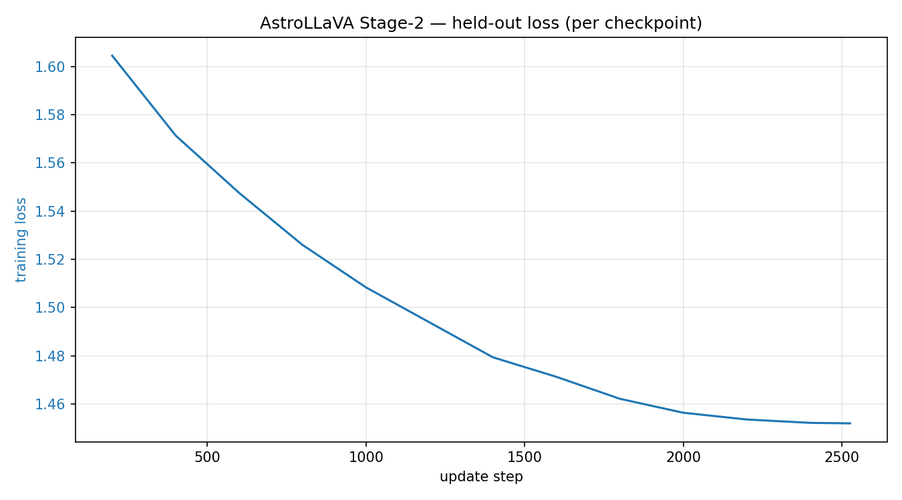

# AstraQ-VL Stage-2 (connector + LoRA instruction tuning)

A LLaVA-style vision–language model that lets **Qwen2.5-1.5B-Instruct** answer questions about
astronomy images encoded by **CLIP ViT-L/14**. This is the **AstraQ-VL Stage-2** model: it warm-starts the
[AstraQ-VL Stage-1 connector](https://huggingface.co/grKnight/astraq-vl-stage1) and **continues training it
jointly with LoRA adapters on the Qwen LLM**, on the caption + GPT-4 QA records of
[`UniverseTBD/AstroLLaVA_convos`](https://huggingface.co/datasets/UniverseTBD/AstroLLaVA_convos).
The CLIP vision tower stays frozen. Trained on a **disjoint held-out test split** so it can be
evaluated on unseen images.

Stage 1 aligned the connector with the LLM frozen: it grounds *coarse* visual structure but
hallucinates fine specifics. Stage 2 opens up the LLM (via LoRA) so the model learns to *use* the
visual evidence when committing to answers, the recipe's instruction-tuning step.

> ⚠️ This bundle ships the **connector + LoRA adapter only** (not full LLM weights). It is **not** a
> standalone `transformers` model: it needs the custom VLM code from the
> [astraq-vl](https://github.com/crimsonKn1ght/astraq-vl) repo, the two base models
> (auto-downloaded from the Hub), and [`peft`](https://github.com/huggingface/peft) to run.

## Download

A single bundle holds the final checkpoint and everything needed to run / reproduce it:

| Bundle | Contents |
|--------|----------|
| [`astraq-vl-stage2.zip`](https://huggingface.co/grKnight/astraq-vl-stage2/blob/main/astraq-vl-stage2.zip) | `checkpoint-2526/` (`connector.safetensors` + `lora/`), `predictions_test_stage2.jsonl`, `finetune_astraq_vl_stage2.yaml`, `test.json`, `REPRODUCE.md` |

`checkpoint-2526/` contains the continued-trained connector (`connector.safetensors`), the trained
LoRA adapter (`lora/adapter_model.safetensors` + `adapter_config.json`), optimizer/scheduler state
(`training_state.pt`), and `meta.json` (step + final loss). **Both** the connector and the LoRA are
required at inference.

## Architecture

```
image ─► CLIP ViT-L/14 (FROZEN) ─► MLP connector (TRAINED, init from Stage-1) ─► Qwen2.5-1.5B + LoRA (base FROZEN, LoRA TRAINED) ─► text
                                    1024 → 1536 → 1536
```

- **Vision:** `openai/clip-vit-large-patch14`, penultimate-layer patch features (frozen)
- **Connector:** 2-layer MLP with GELU, 1024→1536→1536; **warm-started from Stage-1 `checkpoint-3789`** and kept trainable
- **LLM:** `Qwen/Qwen2.5-1.5B-Instruct`, base frozen + **LoRA adapters** (`r=16`, `α=32`, dropout 0.05) on `q/k/v/o/gate/up/down_proj` across all 28 layers
- **Trainable / total:** 22,400,000 / 1,868,879,360 (1.20%): connector 3,935,232 + LoRA 18,464,768

## Training

| | |
|---|---|
| Data | `UniverseTBD/AstroLLaVA_convos`, same per-image held-out split as Stage-1: train 161,653 recs / 29,151 imgs, test 591 imgs / 3,271 recs |
| Initialization | connector ← Stage-1 `checkpoint-3789` (epoch 3); LoRA ← fresh (no-op init) |
| Objective | next-token cross-entropy on answer tokens only (connector + LoRA trainable) |
| Epochs / steps | 1 epoch, 2,526 update steps |
| Effective batch | 64 (per-device 4 × grad-accum 16) |
| LR / schedule | 2e-4, cosine with 3% warmup (75 steps) |
| Max length | 512 (+256 image tokens) |
| Precision | bf16 (autocast) + gradient checkpointing |
| Hardware | 1× RTX 6000 Ada (48 GB), ~15 samples/s (~3 h) |
| Held-out loss | 1.60 (step 200) → **1.452** (step 2526), decreasing monotonically; see Training curve below |

The full-LLM backward pass (absent in Stage-1) is the memory driver, hence per-device batch 4 +
gradient checkpointing to fit ~48 GB. One epoch is the LLaVA instruction-tuning convention: the
model only needs to learn to *use* the already-aligned visual features, not to align them from
scratch.

## Training curve

Held-out validation loss, recomputed per checkpoint on a fixed 512-sample subset of the unseen
`test.json` and averaged over its answer tokens. (The per-step training log wasn't retained, so this
was reconstructed from the saved checkpoints with `scripts/eval_loss_curve.py`, which makes it a
true held-out curve rather than a noisy train-loss trace.) It falls monotonically and flattens by the
end of the single epoch, consistent with the 1-epoch choice:

| step | 200 | 400 | 600 | 800 | 1000 | 1200 | 1400 | 1600 | 1800 | 2000 | 2200 | 2400 | 2526 |
|------|----:|----:|----:|----:|-----:|-----:|-----:|-----:|-----:|-----:|-----:|-----:|-----:|
| held-out loss | 1.605 | 1.571 | 1.548 | 1.526 | 1.508 | 1.494 | 1.479 | 1.471 | 1.462 | 1.456 | 1.454 | 1.452 | **1.452** |



Regenerate with `python scripts/eval_loss_curve.py --config configs/finetune_astraq_vl_stage2.yaml
--checkpoint-dir checkpoints/astraq-vl-stage2 --records-json datasets/astrollava_llava/test.json
--image-dir datasets/astrollava_llava/images --num-samples 512 --plot` (full series in
`eval_loss_curve.csv`).

## Usage

```bash
# 1. get the code
git clone https://github.com/crimsonKn1ght/astraq-vl && cd astraq-vl
pip install -r requirements.txt        # includes peft

# 2. download + unzip the bundle
hf download grKnight/astraq-vl-stage2 astraq-vl-stage2.zip --local-dir .
unzip astraq-vl-stage2.zip -d ckpt2

# 3. answer a question about an image (CLIP + Qwen auto-download; peft loads the LoRA)
python inference.py \
  --config ckpt2/finetune_astraq_vl_stage2.yaml \
  --checkpoint ckpt2/checkpoint-2526 \
  --image your_astro_image.jpg \
  --prompt "What type of object is this and what is notable about it?" \
  --temperature 0
```

Pass the Stage-2 **config** so the LoRA modules are built before the adapter weights load; the loader
then restores both the connector and the LoRA automatically. The bundled
`predictions_test_stage2.jsonl` holds the held-out outputs with their reference captions.

## Capabilities & limitations

Stage 2 fine-tunes the LLM (LoRA) jointly with the connector, so, unlike Stage-1, the language
model itself learns from the QA pairs rather than improvising specifics from its frozen prior. The
intended effect is **fewer hallucinated fine details** (catalog numbers, instruments, dates) on
question-answering prompts, on top of Stage-1's coarse visual grounding. Compare the bundled
`predictions_test_stage2.jsonl` with Stage-1's `predictions_test_ep3.jsonl` (held out, same images)
to see the difference.

Limitations carried over from the design: CLIP's 224×224 input discards fine astronomical detail;
the base LLM is small (1.5B); and LoRA is a low-rank adaptation, not a full fine-tune. Evaluation is
a held-out generation set, not a full quantitative benchmark: read results qualitatively.

## Full held-out evaluation (preprint)

Run the full held-out benchmark (all 3,271 caption + QA records) with:

```bash
python scripts/run_full_heldout_eval.py --stage stage2 --num-samples 0 --resume --package
```

This scores all held-out records with one shared pipeline: ROUGE-L, token-F1, exact match,
specificity hallucination, unsupported specifics, SBERT, NLI consistency, and contradiction rate.
See `docs/full_heldout_eval.md`, `docs/qwen_vl_full_heldout_baseline.md`, and
`docs/astrollava_reference_full_heldout_baseline.md` for the full write-up.

Overall held-out comparison:

| Model | n | ROUGE-L up | Token-F1 up | Exact match up | Specificity halluc. down | Pred. specifics / rec. | Unsupported / rec. down | Spec. precision up | SBERT up | NLI up | Contradiction down |
|---|---:|---:|---:|---:|---:|---:|---:|---:|---:|---:|---:|
| Stage-1 epoch 3 | 3271 | 0.3116 | 0.3672 | 0.0272 | 0.2372 | 0.4632 | 0.3733 | 0.1941 | 0.7150 | -0.1084 | 0.5671 |
| Stage-2 | 3271 | **0.3404** | **0.3948** | **0.0339** | 0.2284 | 0.4405 | 0.3369 | **0.2353** | **0.7313** | -0.0795 | 0.5436 |
| Qwen2.5-VL-7B | 3271 | 0.1610 | 0.2156 | 0.0003 | 0.2727 | 0.5812 | 0.4946 | 0.1489 | 0.6224 | **0.0281** | **0.1764** |
| AstroLLaVA reference | 3240 | 0.1759 | 0.1993 | 0.0000 | **0.1722** | 0.2423 | **0.2207** | 0.0892 | 0.4656 | 0.0101 | 0.5836 |

The current result story is deliberately nuanced: Stage-2 improves in-domain held-out reference
alignment and reduces unsupported specifics compared with Stage-1, while Qwen2.5-VL is much less
contradictory under the NLI proxy. The unsupported-specific gain is not just a "says less" result:
Stage-2 emits slightly fewer detected specifics than Stage-1 (0.4405 vs 0.4632 per record), but its
reference-supported specificity precision proxy rises from 0.1941 to 0.2353. AstroLLaVA reference is
included as a domain comparator, but it has possible data-lineage overlap and 31 unscored rows that
should be inspected before final paper claims.

The release ZIPs used for the table are committed under `eval_runs/full_heldout/` with checksums in
`eval_runs/full_heldout/SHA256SUMS.txt`. Each ZIP contains the held-out `test.json`, predictions,
aggregate metrics, per-sample metrics, and reproduction notes for that model family.

For preprint-strength analysis, run the offline workflow in `docs/preprint_offline_analysis.md`:
paired bootstrap confidence intervals, AstroLLaVA skipped-row inspection, honestly mined
qualitative examples, and a 100-200 item human/LLM judge sample.

## Reproduction

The bundle's `REPRODUCE.md` pins the exact code commit, base models, the seeded dataset-build
command, the training command, and package versions (`torch`, `transformers`, `peft`). The split is
seeded, so the build reproduces the exact train/test partition.

```
prereq: Stage-1 connector checkpoint-3789 (grKnight/astraq-vl-stage1 ep3 bundle)
build:  python scripts/build_astrollava_trainset.py --include-qa --max-image-size 384 --test-fraction 0.02 --seed 42
train:  python train.py --config configs/finetune_astraq_vl_stage2.yaml
eval:   python scripts/batch_inference.py --config configs/finetune_astraq_vl_stage2.yaml --records-json datasets/astrollava_llava/test.json --num-samples 0 ...
```

## License & attribution

- **Weights:** `cc-by-sa-4.0`, inherited from the training data.
- **Training data:** [`UniverseTBD/AstroLLaVA_convos`](https://huggingface.co/datasets/UniverseTBD/AstroLLaVA_convos)
  (CC-BY-SA-4.0); imagery from NASA APOD, ESO, and NASA/ESA Hubble.
- **Base models:** Qwen2.5-1.5B-Instruct (Apache-2.0), CLIP ViT-L/14 (OpenAI, MIT).
- **Builds on:** [AstraQ-VL Stage-1](https://huggingface.co/grKnight/astraq-vl-stage1) and the
  AstroLLaVA work ([arXiv:2504.08583](https://arxiv.org/abs/2504.08583)).
```
