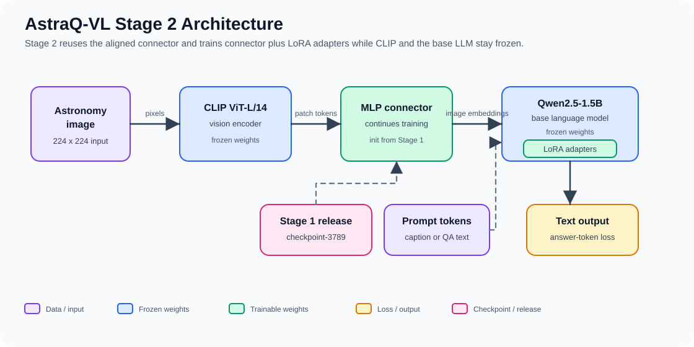

# TerraQ-VL: Vision-Language Model (VLM) for Remote Sensing - Stage 1 Alignment + Stage 2 Instruction Tuning

[](LICENSE)
[](requirements.txt)
[](https://huggingface.co/grKnight/terraq-vl)

TerraQ-VL is a minimal, efficient Vision-Language Model for remote-sensing (aerial/satellite) imagery, following the LLaVA architecture. **Stage 1** trains only a lightweight MLP connector to align frozen CLIP vision features with a frozen LLM. **Stage 2** then warm-starts that connector and fine-tunes the LLM with LoRA adapters on instruction (QA) data, closing the gap between coarse grounding and factual specificity, at minimal computational cost. The same codebase also trained an astronomy sibling model, **AstraQ-VL**, documented further below.

## Overview

This implementation bridges a frozen CLIP vision encoder (`openai/clip-vit-large-patch14`) and a frozen instruction-tuned LLM (`Qwen/Qwen2.5-3B-Instruct` for TerraQ-VL, `Qwen/Qwen2.5-1.5B-Instruct` for AstraQ-VL) using a simple 2-layer MLP connector. Only the connector (~3.9M parameters) is trained on image-caption pairs; both the vision encoder and LLM remain frozen throughout training.

**Key Design Principles:**
- **Simplicity**: No Q-Former, no cross-attention, just a linear projection with GELU
- **Efficiency**: Frozen models save memory; only train the connector
- **Proven approach**: Follows LLaVA Stage 1 alignment, a well-validated recipe

> Models trained with this codebase are released on the Hub. The **remote-sensing** flagship,
> **TerraQ-VL** (Qwen2.5-3B + VRSBench), is at **[`grKnight/terraq-vl`](https://huggingface.co/grKnight/terraq-vl)**:
> every Stage-1 and Stage-2 checkpoint, configs, held-out loss curves, and predictions. See
> [Trained Model: TerraQ-VL (Remote Sensing / VRSBench)](#trained-model-terraq-vl-remote-sensing--vrsbench).
>
> Its astronomy sibling, **AstraQ-VL** (Qwen2.5-1.5B), is released as
> **Stage 1** (connector) at [`grKnight/astraq-vl-stage1`](https://huggingface.co/grKnight/astraq-vl-stage1)
> and **Stage 2** (connector + LoRA) at [`grKnight/astraq-vl-stage2`](https://huggingface.co/grKnight/astraq-vl-stage2).
> See [Trained Model: AstraQ-VL Stage-1](#trained-model-astraq-vl-stage-1-astronomy) and
> [AstraQ-VL Stage 2: Visual Instruction Tuning (LoRA)](#astraq-vl-stage-2-visual-instruction-tuning-lora) for
> dataset, training, testing, and download details.

## Architecture



```
Image (3, 224, 224)
    ↓
[CLIP ViT-L/14: Frozen] → 256 patch tokens (B, 256, 1024)
    ↓
[MLP Connector: Trainable] → (B, 256, 1536)
    ↓ (concatenated with)
Text Embeddings (B, T, 1536) from LLM embedding table
    ↓
[Qwen2.5 LLM: Frozen] → Loss   # 3B for TerraQ-VL, 1.5B for AstraQ-VL
```

**Training objective**: Next-token prediction on image-text pairs. Visual tokens are masked out of the loss; only the caption tokens contribute to gradient updates on the connector.

## Installation

```bash
# Clone or navigate to the project directory
cd vlm

# Install dependencies
pip install -r requirements.txt
```

**Requirements:**
- Python ≥ 3.10
- PyTorch ≥ 2.1.0
- CUDA 11.8+ (for GPU training)
- GPU memory scales with caption length: short-caption datasets (e.g. LLaVA-Pretrain) are light, while the AstraQ-VL Stage-1 run (long captions + QA, batch 8) measured **~38 GB** on an RTX 6000 Ada, see [Trained Model: AstraQ-VL Stage-1](#trained-model-astraq-vl-stage-1-astronomy)

## Quick Start

### 1. Prepare Data

Download the LLaVA-Pretrain dataset or use your own image-text pairs in LLaVA format:

```json
[
  {
    "id": "...",
    "image": "path/to/image.jpg",
    "conversations": [
      {"from": "human", "value": "<image>\nDescribe this image."},
      {"from": "gpt", "value": "A detailed caption here."}
    ]
  },
  ...
]
```

### 2. Configure Training

Edit `configs/pretrain_stage1.yaml`:

```yaml
data:
  train_data_path: "/path/to/train.json"  # your LLaVA-format dataset
  image_dir: "/path/to/images"
  max_length: 2048

training:
  output_dir: "./checkpoints/pretrain-stage1"
  per_device_batch_size: 8
  gradient_accumulation_steps: 32  # effective batch = 256
  num_epochs: 1
```

### 3. Train

```bash
# Single GPU
python train.py --config configs/pretrain_stage1.yaml

# Multi-GPU with accelerate
accelerate launch train.py --config configs/pretrain_stage1.yaml
```

Training logs appear in stdout. Checkpoints are saved every 500 steps to `./checkpoints/pretrain-stage1/`.

**Reading the loss.** The logged training loss is a **token-weighted** running mean (weighted by each
micro-batch's supervised-token count), so a one-word VQA answer no longer jitters the curve like a
long caption; the line tracks the real trend instead of bouncing per step.

**Validation loss (overfitting / when to stop).** Use a **three-way split**: train / validation /
test. The builders carve a disjoint validation split **out of the held-out pool** with `--val-fraction`,
so `val.json` is used *during* training while `test.json` stays untouched for final evaluation (never
select on the test set). Crucially, the training data is byte-identical to a test-only build, so a
Stage-1 connector trained without validation stays valid when you warm-start Stage 2:

```bash
# Hold out 2% of images, split evenly into val + test (disjoint by image); train unchanged.
# Use the SAME --test-fraction your Stage-1 build used, so the val/test images are exactly the ones
# Stage 1 never saw (a Stage-2 run warm-started from that connector then has no leakage).
python scripts/build_vrsbench_trainset.py --output-dir datasets/vrsbench_llava \
    --test-fraction 0.02 --val-fraction 0.5

# Already built the images? Re-split the JSON only (no 8.4 GB re-download, images untouched):
python scripts/build_vrsbench_trainset.py --output-dir datasets/vrsbench_llava \
    --test-fraction 0.02 --val-fraction 0.5 --no-images --overwrite
```

Point `data.val_data_path` at that `val.json` and the trainer scores it every `training.eval_steps`,
logging a `Val loss:` line and recording it in each checkpoint's `meta.json`:

```yaml
data:
  val_data_path: datasets/vrsbench_llava/val.json    # disjoint validation split (NOT test.json)
training:
  eval_steps: 100        # validation-loss cadence (defaults to save_steps)
  eval_num_samples: 512  # cap scored samples per eval for speed (0 = all)
```

Overlay both curves with `python scripts/plot_training_curve.py train.log --out curve --plot`:
train falling while val flattens or rises is overfitting (keep the **best-val** checkpoint, which the
script prints); both still falling means more training would help. This is the same token-weighted,
fixed-set method as the offline [`scripts/eval_loss_curve.py`](scripts/eval_loss_curve.py), now
computed live during the run. Run that offline script on `test.json` for the final held-out number.

### 4. Inference

```bash
python inference.py \
  --config configs/pretrain_stage1.yaml \
  --checkpoint ./checkpoints/pretrain-stage1/checkpoint-500 \
  --image /path/to/image.jpg \
  --prompt "What is in this image?"
```

## Project Structure

```
vlm/
├── train.py                        # Training entry point
├── inference.py                    # Inference script
├── requirements.txt                # Dependencies
├── configs/
│   └── pretrain_stage1.yaml        # Hyperparameter config
├── vlm_model/
│   ├── utils.py                    # Constants, helper functions
│   ├── connector.py                # MLP projection layer (trainable)
│   ├── vision_encoder.py           # CLIP ViT-L/14 wrapper
│   ├── language_model.py           # Qwen2.5-1.5B-Instruct wrapper
│   └── vlm.py                      # Composite VLM model
├── data/
│   ├── image_processing.py         # CLIP image transforms
│   ├── conversation.py             # Conversation tokenization + label masking
│   ├── dataset.py                  # LLaVAPretrainDataset
│   └── collator.py                 # Batch collation
└── training/
    ├── lr_scheduler.py             # Cosine warmup scheduler
    ├── checkpoint.py               # Checkpoint save/load
    └── trainer.py                  # Training loop
```

## Key Hyperparameters

| Parameter | Value | Rationale |
|-----------|-------|-----------|
| Learning Rate | 2e-3 | High (connector only), follows LLaVA |
| Weight Decay | 0.0 | No regularization needed for small connector |
| Batch Size | 256 (effective) | Via 8 × 32 (batch × accumulation) |
| Warmup | 3% of steps | Short warmup; model components are pre-trained |
| Schedule | Cosine decay | Smooth convergence to near-zero lr |
| Precision | bf16 | Mixed precision for efficiency |
| Epochs | 1 | Single pass over the pretraining set (LLaVA Stage-1 convention) |

## Performance & Memory

**Trainable Parameters**: ~3.9M (only the MLP connector)
**Frozen Parameters**: ~1.8B (CLIP + LLM)
**GPU Memory**: ~6–8 GB (batch_size=8, bf16) for short-caption datasets like LLaVA-Pretrain. Memory scales with sequence length: the AstraQ-VL Stage-1 run (long captions + QA, `max_length 512`) measured **~38 GB at batch_size=8** on an RTX 6000 Ada; plan on a 40 GB+ GPU at that batch, or a smaller batch / shorter `max_length` on 24 GB.

For measured throughput and training time on real data, see [Trained Model: AstraQ-VL Stage-1](#trained-model-astraq-vl-stage-1-astronomy) (~26 samples/s on an RTX 6000 Ada).

## What Gets Trained

Only the connector's weights are updated:
- `model.connector.mlp[0].weight`: (1536, 1024)
- `model.connector.mlp[0].bias`: (1536,)
- `model.connector.mlp[2].weight`: (1536, 1536)
- `model.connector.mlp[2].bias`: (1536,)

Both the vision encoder (`vision_encoder.model`) and LLM (`language_model.model`) are frozen via `requires_grad=False`.

## Data Format Details

The dataset expects a JSON file with the LLaVA-Pretrain structure:
- Each entry must have `"image"` (relative path to image), `"conversations"` (list of turns)
- Conversations are `[{"from": "human", "value": "..."}, {"from": "gpt", "value": "..."}]`
- The `<image>` placeholder in the human message is replaced with visual token embeddings during training
- Labels are masked (`-100`) for all tokens except the assistant's response

## Inference Details

During inference:
1. The image is preprocessed via CLIP's image processor (224×224 resize, normalization)
2. CLIP encodes it to 256 patch tokens (1024-dim each)
3. The connector projects to 1536-dim (LLM embedding space)
4. Text prompt is tokenized and embedded via the LLM's embedding layer
5. Visual and text embeddings are concatenated and fed to the LLM
6. Autoregressive generation proceeds with `model.generate(...)`

The `<image>` token in the prompt is automatically replaced with visual embeddings; it does not appear in the final token sequence.

## Trained Model: AstraQ-VL Stage-1 (Astronomy)

The AstraQ-VL Stage-1 connector trained with this codebase is released on the Hugging Face Hub:
**https://huggingface.co/grKnight/astraq-vl-stage1**. It was trained for **3 full epochs** on
[`UniverseTBD/AstroLLaVA_convos`](https://huggingface.co/datasets/UniverseTBD/AstroLLaVA_convos)
(~29.8k NASA APOD / ESO / Hubble images, CC-BY-SA-4.0), with a **disjoint held-out test split**
(591 images / 3,271 records) carved out before training. Three per-epoch bundles are published;
`checkpoint-3789` (epoch 3) is the recommended weight, reaching a training loss of ~2.08 → ~1.50
(0.21% of params trainable, ~26 samples/s / ~38 GB VRAM on an RTX 6000 Ada).

On the held-out set, quality improved monotonically across epochs: epoch 1 misidentified objects,
epoch 2 fixed the object category, and epoch 3 additionally recovered specific object names (e.g.
"SN 1987A" and "the Dumbbell Nebula") on images it never trained on, genuine generalization rather
than memorization. The connector still **hallucinates fine specifics** (catalog numbers,
instruments, dates) filled from the frozen LLM's prior; that ceiling motivates Stage 2 below.

Config: `configs/pretrain_astraq_vl.yaml`. Full dataset stats, per-epoch training settings, the
held-out qualitative comparison table, and reproduction steps (pinned commit, package versions,
seeded build command) are in **[`MODEL_CARD.md`](MODEL_CARD.md)**.

## AstraQ-VL Stage 2: Visual Instruction Tuning (LoRA)

**Stage 2** warm-starts the Stage-1 connector and keeps training it while fine-tuning the Qwen LLM
with **LoRA adapters** (`r=16`, `α=32`) on the same caption + QA data, so the model learns to *use*
visual evidence rather than only grounding coarse categories. The vision encoder stays frozen.

```
image ─► CLIP ViT-L/14 (FROZEN) ─► MLP connector (TRAINED, init from Stage-1) ─► Qwen2.5-1.5B + LoRA (base FROZEN, LoRA TRAINED) ─► text
```

The trained model is published at **https://huggingface.co/grKnight/astraq-vl-stage2**
(`checkpoint-2526`, 1 epoch, held-out loss 1.60 → **1.452**, monotonic). Full training settings,
the loss curve, and the preprint-facing full held-out benchmark (3,271 records scored against a
Qwen2.5-VL-7B and an AstroLLaVA reference baseline) are in
**[`MODEL_CARD_STAGE2.md`](MODEL_CARD_STAGE2.md)**. Headline: Stage-2 improves ROUGE-L, token-F1,
exact match, and reference-supported specificity precision over Stage-1 (0.1941 → 0.2353), while
emitting fewer unsupported specific details per record.

```bash
# download + unzip
hf download grKnight/astraq-vl-stage2 astraq-vl-stage2.zip --local-dir .
unzip astraq-vl-stage2.zip -d ckpt2

# answer a question about an image (CLIP + Qwen auto-download; peft loads the LoRA adapter)
python inference.py \
  --config ckpt2/finetune_astraq_vl_stage2.yaml \
  --checkpoint ckpt2/checkpoint-2526 \
  --image your_astro_image.jpg \
  --prompt "What type of object is this and what is notable about it?" \
  --temperature 0
```

## Trained Model: TerraQ-VL (Remote Sensing / VRSBench)

The remote-sensing counterpart of AstraQ-VL: same CLIP + Qwen2.5-3B + MLP-connector architecture,
ported to aerial/satellite imagery. **Every** Stage-1 and Stage-2 checkpoint (not just a
representative few), configs, held-out loss curves, and predictions are released on the Hub:

**https://huggingface.co/grKnight/terraq-vl**

```
stage-1/checkpoints/checkpoint-100 … checkpoint-3270   (33 checkpoints, connector-only)
stage-2/checkpoints/checkpoint-200 … checkpoint-2180   (connector + LoRA adapter)
stage-1/  stage-2/   each also: config/  curves/  predictions/  data/  MODEL_CARD.md  manifest.json
```

Checkpoints are stored as **raw, directly-loadable directories** (no unzip needed): each Stage-1
dir has `connector.safetensors` + `training_state.pt` + `meta.json`; each Stage-2 dir adds
`lora/adapter_model.safetensors` + `lora/adapter_config.json`. `manifest.json` lists every file with
its sha256. See each `stage-*/MODEL_CARD.md` on the Hub for the exact per-checkpoint train + held-out
validation loss.

### Dataset (three-way, disjoint-by-image split)

Training used [`xiang709/VRSBench`](https://huggingface.co/datasets/xiang709/VRSBench)
(CC-BY-NC-4.0): ~29.6k aerial/satellite images (DOTA-v2 / DIOR via Google Earth) with a
human-verified detailed caption plus visual question–answer turns. `scripts/build_vrsbench_trainset.py`
carves a **validation** split out of the held-out pool (`--val-fraction`) *in addition to* the test
split, so validation never touches the test set and training data is unaffected:

```bash
python scripts/build_vrsbench_trainset.py --output-dir datasets/vrsbench_llava \
  --test-fraction 0.02 --val-fraction 0.5 --max-image-size 384 --seed 42
```

| Split | Images | Records |
|-------|-------:|--------:|
| train (`train.json`) | 19,861 | 139,575 |
| validation (`val.json`) | 204 | 1,448 |
| held-out test (`test.json`) | 197 | 1,367 |

The split is per **image** (seeded, deterministic): an image's caption and all its VQA turns stay
together, so there is no leakage between train / val / test.

### Stage 1: connector alignment

Config: `configs/pretrain_vrsbench.yaml`; run `python train.py --config configs/pretrain_vrsbench.yaml`.

| Setting | Value |
|---------|-------|
| Trainable | connector only (~4.2M params, vision + LLM frozen) |
| Epochs / steps | 3 epochs, 3,270 update steps |
| Effective batch | 128 (per-device 8 × grad-accum 16) |
| Learning rate / schedule | 1e-3, cosine, 3% warmup |
| Precision | bf16 |
| Held-out validation loss | **1.7933 → 1.2091** (monotonic, token-weighted, recomputed on 512 held-out `val.json` samples via [`scripts/eval_loss_curve.py`](scripts/eval_loss_curve.py)) |

`checkpoint-3270` (final) is the recommended Stage-1 weight and the one Stage-2 warm-starts from.

### Stage 2: visual instruction tuning (LoRA)

Config: `configs/finetune_vrsbench_stage2.yaml`; run `python train.py --config configs/finetune_vrsbench_stage2.yaml`
after pointing `stage1_checkpoint` at the Stage-1 checkpoint above.

| Setting | Value |
|---------|-------|
| Trainable | connector (warm-started) + LoRA on the LLM (r=16, α=32, dropout=0.05; q/k/v/o/gate/up/down_proj), 36.2M / 3.42B params (1.06%) |
| Epochs / steps | 1 epoch, 2,180 update steps |
| Effective batch | 64 (per-device 8 × grad-accum 8), gradient checkpointing |
| Learning rate / schedule | 2e-4, cosine, 3% warmup |
| Precision | bf16 |
| Hardware tested | L40S (48 GB) and RTX PRO 6000 Blackwell (96 GB) |

Held-out predictions cover all 1,367 `test.json` records (captions **and** VQA turns, each asked its
own question) via [`scripts/generate_heldout_records.py`](scripts/generate_heldout_records.py); see
`stage-2/predictions/` on the Hub.

Trained-weight license: **research / non-commercial** (Qwen Research License + VRSBench
CC-BY-NC-4.0); see [Model & Data Licensing](#model--data-licensing) for the full breakdown.

## Medical RAG Layer (Retrieval-Augmented Grounding)

On top of the frozen VLM, this repo includes an **inference-time retrieval-augmented
generation (RAG) pipeline** for reducing hallucination in medical visual question
answering. It implements the research methodology in three phases:

1. **Phase 1: Baseline hallucination characterization.** Evaluate the frozen VLM on
   **VQA-RAD** / **PathVQA** with **exact-match accuracy** *and* **NLI-based
   factual-consistency** (`eval/`).
2. **Phase 2: Retrieval + ablation.** Build a corpus of image-report pairs, index dense
   clinical-SBERT report vectors and pooled CLIP visual embeddings in **FAISS** plus a
   **BM25** sparse index, retrieve top-k pairs and **prepend** them as a structured context
   block. Ablate **dense-visual / sparse-BM25 / hybrid (RRF + cross-encoder rerank)**
   (`retrieval/`, `corpus/`, `eval/ablation.py`).
3. **Phase 3: Refinements (scaffolded).** Query decomposition, adaptive context windows,
   modality-aware weighting are wired as inert, config-gated hooks (`ragcore/phase3_stubs.py`).

**Key property:** grounding is entirely prompt-level. The retrieved references are inserted
*after* the `<image>` token and *before* the question, so `prepare_inputs_embeds` is
unchanged: **no retraining, no model/tokenizer/connector edits**. Model ids are
config-driven, so a domain-specialized medical VLM / encoder swaps in by editing
`configs/rag_eval.yaml` only.

### New packages

```
retrieval/   BaseRetriever seam + dense_visual / sparse_bm25 / hybrid + encoders, faiss, bm25, reranker
corpus/      CorpusLoader interface: iu_xray, roco (open), mimic_cxr (credentialed stub), synthetic; build_index
eval/        VQA-RAD/PathVQA loaders, exact-match, NLI consistency, runner, ablation driver
ragcore/     context formatting (prepend), checkpoint-optional model loader, Phase-3 stubs
rag_inference.py   retrieve -> format -> prepend -> model.generate
configs/rag_eval.yaml
```

### Install the extra dependencies

```bash
pip install faiss-cpu sentence-transformers rank-bm25
# (NLI factual-consistency reuses the existing `transformers` pipeline, no extra dep.)
```

### Usage

```bash
# 1. Build a tiny synthetic index (no downloads, no PHI) to smoke-test the wiring
python -m corpus.build_index --config configs/rag_eval.yaml --synthetic --max_pairs 10

# 2. Phase-1 no-retrieval baseline on a few VQA-RAD samples
python -m eval.ablation --config configs/rag_eval.yaml --modes no_retrieval --num_samples 5

# 3. Full ablation + comparison table (./rag_results/comparison.md)
python -m eval.ablation --config configs/rag_eval.yaml \
    --modes no_retrieval dense_visual sparse_bm25 hybrid --num_samples 5

# 4. Single grounded answer
python rag_inference.py --config configs/rag_eval.yaml \
    --image path/to/image.png --question "Is there cardiomegaly?" --mode hybrid
```

To use a real open corpus, set `corpus.name: roco` (verified: `eltorio/ROCO-radiology`) in
the config and re-run `corpus.build_index`. `iu_xray` has no canonical HF mirror: set
`corpus.hf_id` to one you've verified. `mimic_cxr` is a credentialed stub (PhysioNet access).
The model loader runs with an **untrained connector** when `model.checkpoint` is null, fine
for exercising retrieval and prompt formatting; set it to a trained connector dir for
meaningful generations.

### Running the real experiment on a GPU

A CUDA GPU is recommended; the first run downloads the encoder/LLM/NLI
weights (~7 GB total) and caches them. Datasets and the corpus **stream and are capped**, so
only what's needed downloads.

```bash
pip install -r requirements.txt          # includes faiss-cpu, sentence-transformers, rank-bm25

# One command: build the ROCO index, then run the full 4-way ablation on VQA-RAD.
python run_rag.py --config configs/rag_eval_gpu.yaml

# Reuse an already-built index and just re-run the eval:
python run_rag.py --config configs/rag_eval_gpu.yaml --skip-index
```

Results land in `./rag_results/` (`results_<mode>.json` per mode + `comparison.md`).
Tune `configs/rag_eval_gpu.yaml`: `corpus.max_pairs` (index size), `eval.num_samples`
(toward the full ~451 VQA-RAD test set for final numbers), `eval.benchmark` (`path_vqa`),
and `eval.modes`.

> **For meaningful numbers you need a trained VLM.** With `model.checkpoint: null` the
> connector is random and the answers (hence EM/NLI) are not meaningful; the run still
> validates the full pipeline. Train the connector first (`python train.py ...`) and set
> `model.checkpoint`, or swap `model.config` to a fully-trained medical VLM.

### Porting to another domain (astronomy example)

The pipeline is domain-agnostic; an astronomy variant ships as a worked example. The core
(`retrieval/`, `eval/runner.py`, `eval/ablation.py`, the prepend logic, Phase-3 hooks) is
reused **unchanged**, only domain-specific pieces were added:

- **Corpus:** `corpus/galaxy_zoo.py`: Galaxy10 DECaLS (`matthieulel/galaxy10_decals`,
  verified); morphology class labels are turned into descriptive "reports".
- **Benchmark:** `eval/astro_benchmarks.py`: VQA generated from the held-out test split
  (open "what type" + balanced closed yes/no), returned as the same `VQASample`.
- **Prompt wording:** now config-driven. `ragcore/context_format.py` reads an optional
  `prompt:` block (`system`, `references_header`, `references_footer`); medical text remains
  the default, so existing configs are untouched.
- **Config:** `configs/rag_eval_astro.yaml` (galaxy corpus/benchmark, general SBERT,
  astronomy prompt).

```bash
python run_rag.py --config configs/rag_eval_astro.yaml          # GPU
python run_rag.py --config configs/rag_eval_astro.yaml --synthetic --num_samples 5   # CPU smoke
```

What a *production* astronomy port still needs (documented, not done): swapping the CLIP
vision tower for an astronomy model (e.g. AstroCLIP), which is not a drop-in `CLIPVisionModel`
and **requires retraining the connector**, plus FITS/dynamic-range image handling in
`data/image_processing.py`. Standard CLIP on RGB galaxy cutouts is adequate only for the
prototype.

### Known limitations
- **CLIP 224×224** downsamples fine medical detail (caps both VLM and dense-visual quality);
  `retrieval.visual_encoder_id` is swappable (e.g. BiomedCLIP).
- **NLI domain mismatch:** the default `roberta-large-mnli` under-handles clinical
  negation/hedging; swap `eval.nli_model_id` for a MedNLI/SciNLI checkpoint and read NLI as
  relative-across-modes.
- **FAISS `IndexFlatIP`** is exact and correct at sample scale; swap to IVF/HNSW in
  `retrieval/faiss_index.py` for MIMIC-scale corpora.

## Next Steps

This implementation covers **Stage 1: Feature Alignment** and **Stage 2: Visual Instruction Tuning
(LoRA)** (see [Stage 2: Visual Instruction Tuning (LoRA)](#astraq-vl-stage-2-visual-instruction-tuning-lora)).
Further extensions might include:

1. **Full Model Tuning**: Unfreeze all LLM layers (instead of LoRA) for more capacity at higher VRAM cost
2. **Cross-Attention Connector**: Replace MLP with a learned cross-attention mechanism for better spatial reasoning
3. **Higher-Resolution Images**: Support variable image resolutions and dynamic patching
4. **Multi-Image Support**: Handle multiple images per prompt
5. **Evaluation**: Add benchmarks (VQA, captioning, visual reasoning tasks)

## Troubleshooting

**Out of Memory (OOM)**
- Reduce `per_device_batch_size` (try 4 or 2)
- Increase `gradient_accumulation_steps` to maintain effective batch size
- Enable `bf16` mixed precision (already default)

**Slow Data Loading**
- Increase `dataloader_num_workers` (try 8 or 16)
- Pre-extract CLIP features to disk to bypass image I/O

**NaN Loss**
- Check label masking: visual token positions should have `labels = -100`
- Verify `attention_mask` has correct shape and no all-zero rows
- Reduce learning rate if instability persists

## References

- **LLaVA**: [Visual Instruction Tuning](https://arxiv.org/abs/2304.08485)
- **CLIP**: [Learning Transferable Models for Compositional Vision](https://arxiv.org/abs/2103.14030)
- **Qwen**: [Qwen2.5 Technical Report](https://qwenlm.github.io/blog/qwen2.5/)

## Citation

The **released TerraQ-VL (VRSBench) model checkpoints** ([`grKnight/terraq-vl`](https://huggingface.co/grKnight/terraq-vl))
have a Hugging Face-issued DOI. Cite this if you use those weights (distinct from citing the codebase
itself, which GitHub's "Cite this repository" button covers via [`CITATION.cff`](CITATION.cff)):

```bibtex
@misc{gourab_roy_2026,
	author       = { Gourab Roy },
	title        = { terraq-vl (Revision f7ddb21) },
	year         = 2026,
	url          = { https://huggingface.co/grKnight/terraq-vl },
	doi          = { 10.57967/hf/9584 },
	publisher    = { Hugging Face }
}
```

DOI: **[10.57967/hf/9584](https://doi.org/10.57967/hf/9584)**. The AstraQ-VL (astronomy) checkpoints
do not currently have a separate DOI; cite [`grKnight/astraq-vl-stage1`](https://huggingface.co/grKnight/astraq-vl-stage1)/
[`-stage2`](https://huggingface.co/grKnight/astraq-vl-stage2) by URL until one is minted.

## License

The **code in this repository** is released under the **MIT License**; see the [`LICENSE`](LICENSE)
file (© 2026 Gourab Roy). MIT covers the source code only. The pretrained base models and the
datasets you run it with each carry their **own** licenses, which flow through to any weights you
train or data you redistribute, summarized in the next section.

## Model & Data Licensing

Your code license (MIT) and the license that binds your **trained weights / redistributed data** are
separate. A fine-tuned checkpoint or a derived dataset is governed by the **most restrictive** of the
base model and the training data you actually use, not by MIT.

| Component | Where it's used | License | Commercial use |
|---|---|---|---|
| This repository's code | everywhere | **MIT** (© 2026 Gourab Roy) | ✅ Yes |
| CLIP ViT-L/14 (`openai/clip-vit-large-patch14`) | vision encoder (all configs) | MIT (original OpenAI CLIP) | ✅ Yes |
| Qwen2.5-1.5B-Instruct | backbone configs (`pretrain_stage1`, `pretrain_astraq_vl`, …) | **Apache-2.0** | ✅ Yes |
| Qwen2.5-3B-Instruct | VRSBench configs (`pretrain_vrsbench`, `finetune_vrsbench_stage2`) | **Qwen Research License** (`qwen-research`) | ❌ **Non-commercial**; commercial needs a separate license from Alibaba Cloud |
| AstroLLaVA_convos | astronomy training data | **CC-BY-SA-4.0** | ✅ Yes, with attribution + share-alike |
| VRSBench | remote-sensing training data | **CC-BY-NC-4.0** | ❌ **Non-commercial** + attribution; source images from DOTA-v2 / DIOR (their own academic terms) |

**Net effect by stack:**
- **Default VRSBench + Qwen2.5-3B** (`configs/*vrsbench*.yaml`): trained weights and any derived data
  are **research / non-commercial, attribution-required**. Both the base model (`qwen-research`) and
  the data (CC-BY-NC-4.0) are non-commercial, so the checkpoint inherits that.
- **Astronomy backbone + Qwen2.5-1.5B** (`configs/pretrain_astraq_vl.yaml`): Apache-2.0 model +
  CC-BY-SA-4.0 data → commercial use is possible **with** attribution and share-alike on the data.
- **Want an unrestricted/commercial project?** Use an **Apache-2.0 Qwen variant** (0.5B / 1.5B / 7B /
  14B / 32B, the 3B and 72B are the `qwen-research` exceptions) together with a
  commercially-licensed dataset.

The Qwen Research License additionally forbids using the model's outputs to improve any non-Qwen LLM.

**Attribution / citation.** If you release weights, data, or results, cite and attribute the
components you used:
- **VRSBench**: [dataset](https://huggingface.co/datasets/xiang709/VRSBench) ·
  [paper (arXiv:2406.12384)](https://arxiv.org/abs/2406.12384); and its image sources **DOTA-v2** and
  **DIOR**.
- **AstroLLaVA_convos**: [`UniverseTBD/AstroLLaVA_convos`](https://huggingface.co/datasets/UniverseTBD/AstroLLaVA_convos)
  (arXiv:2504.08583); keep the NASA APOD / ESO / Hubble caption attribution.
- **Qwen2.5**: [Qwen2.5 Technical Report](https://qwenlm.github.io/blog/qwen2.5/) and the model's
  license file. **CLIP**: [OpenAI CLIP](https://github.com/openai/CLIP). **LLaVA**:
  [arXiv:2304.08485](https://arxiv.org/abs/2304.08485).

> This summary is provided for convenience and is **not legal advice**. Always check each model card
> and dataset card for the authoritative, current license terms before redistribution or deployment.

## Contributing

Contributions are welcome. Please:
1. Test your changes with a small dataset subset
2. Verify trainable params count and gradient flow
3. Include clear commit messages

## Questions?

For issues or questions about the implementation, check the inline comments in `vlm_model/vlm.py` (especially `prepare_inputs_embeds()`) and `training/trainer.py` for detailed logic.
